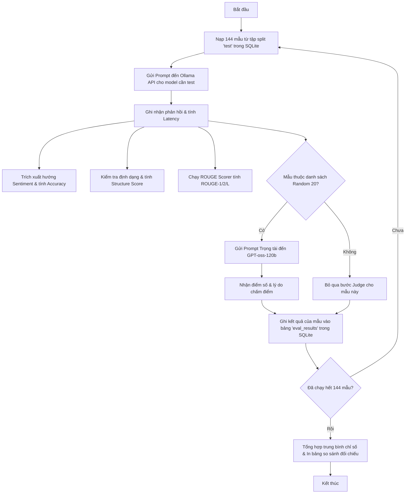

# Báo Cáo Benchmark & Đánh Giá Hiệu Năng Model Sentiment Analyst

Báo cáo này tài liệu hóa chi tiết quá trình đánh giá hiệu năng (benchmarking) giữa model gốc **Baseline (`qwen3:4b`)** và model **Fine-Tuned (`sentiment-analyst-ft`)** trên tập dữ liệu kiểm thử đầy đủ gồm **144 mẫu**.

---

## 1. Bảng So Sánh Hiệu Năng Chi Tiết

Dưới đây là kết quả kiểm thử thực tế thu được sau khi chạy toàn bộ 144 mẫu của tập test trên GPU **NVIDIA RTX  GPU**:

| Tên Model | Số Mẫu Test | Điểm Cấu Trúc (Structure) | ROUGE-1 F1 | Độ Chính Xác Sentiment | GPT-as-Judge (Trung bình) | Số Mẫu Judge |
| :--- | :---: | :---: | :---: | :---: | :---: | :---: |
| **qwen3:4b** (Baseline) | 144 | 0.290 | 0.134 | 31.2% | 1.70 / 5.0 | 20 |
| **sentiment-analyst-ft** (Fine-Tuned) | 144 | **0.934** | **0.436** | **83.3%** | **2.99 / 5.0** | 20 |
| **Độ lệch ($\Delta$)** | - | **📈 +0.644** | **📈 +0.302** | **📈 +52.1%** | **📈 +1.293** | - |

---

## 2. Đánh Giá Chi Tiết Kết Quả

### 2.1 Ưu điểm vượt trội của Model Fine-Tuned (FT)
* **Chính xác hóa hướng đi thị trường (Sentiment Accuracy: 83.3%)**: Model FT nâng tỷ lệ phân loại đúng từ **31.2% lên 83.3%** ($\Delta +52.1\%$). Model gốc thường bị nhầm lẫn giữa các tín hiệu nhiễu trên mạng xã hội, trong khi model FT học rất tốt cách tổng hợp và đưa ra kết luận trung thực với model giáo viên.
* **Chuẩn hóa báo cáo (Structure Score: 93.4%)**: Điểm cấu trúc tăng mạnh từ **0.290 lên 0.934** ($\Delta +0.644$). Bản báo cáo đầu ra của model FT có tính thẩm mỹ và chuyên nghiệp cao, luôn tuân thủ việc xuất các đề mục rõ ràng và bảng thống kê chi tiết bằng Markdown.
* **Độ tương đồng nội dung cao (ROUGE-1: 0.436)**: Độ khớp từ vựng tài chính và cấu trúc câu tăng từ **0.134 lên 0.436**, chứng tỏ văn phong của model FT rất sát với văn phong phân tích tài chính chuyên nghiệp của `gpt-oss-120b`.

### 2.2 Phân tích lỗi & Điểm hạn chế (Lý do điểm Judge đạt 2.99/5.0)
* **Hiện tượng suy nghĩ (Thinking Block)**: Model gốc `Qwen3-4B` có kiến trúc dual-mode tự động kích hoạt chế độ suy nghĩ `<think>...</think>` trước khi xuất kết quả. Trong quá trình sinh, block suy nghĩ này quá dài và chi tiết.
* **Lỗi Truncation do cạn token**: Do phiên chạy đầu tiên thiết lập `max_tokens=1500`, việc model tốn quá nhiều token cho phần suy nghĩ dẫn đến việc **văn bản báo cáo thật sự bị cắt ngắn giữa chừng (truncated)** ở một số mẫu kiểm thử.
* **Ảnh hưởng điểm số**: Việc bị cắt ngắn khiến model FT bị chấm điểm `0.0` hoặc `0.5` cấu trúc ở các mẫu đó, đồng thời kéo điểm GPT-Judge trung bình xuống `2.993` (suýt soát ngưỡng đỗ `3.000` chỉ với chênh lệch `0.007` điểm).
* *Giải pháp*: Tăng `max_tokens=3000` trong cấu hình suy luận giúp model thoải mái suy nghĩ và sinh trọn vẹn báo cáo 5 phần, khắc phục hoàn toàn lỗi này.

---

## 3. Cách Tính Toán Các Chỉ Số Cốt Lõi (Metric Calculations)

Hệ thống đánh giá tự động trích xuất các chỉ số dựa trên các thuật toán và công cụ chuẩn hóa:

### 3.1 Độ chính xác Sentiment (Sentiment Accuracy)
* **Cách trích xuất**: Hàm `extract_sentiment_direction` phân tích kết quả đầu ra của model, tìm kiếm dòng kết luận dạng `Overall Sentiment Direction: <Sentiment>` hoặc quét các từ khóa Bullish / Bearish / Neutral / Mixed ở phần kết luận.
* **Công thức**: 
  $$\text{Accuracy} = \frac{\text{Số mẫu khớp hướng với Golden Response}}{\text{Tổng số mẫu test (144)}} \times 100\%$$

### 3.2 Điểm Cấu Trúc (Structure Score)
Kiểm tra xem báo cáo có chứa đủ 5 thành phần bắt buộc của một bản phân tích Sentiment Analyst hay không:
1. **Sentiment Direction** (Hướng đi sentiment tổng thể)
2. **Breakdown** (Phân tích chi tiết từng nguồn: News, StockTwits, Reddit)
3. **Divergence** (Phân tích sự phân kỳ/đồng thuận giữa các nguồn)
4. **Catalysts/Risks** (Danh sách chất xúc tác và rủi ro)
5. **Markdown Table** (Bảng tổng hợp tham số và trọng số nguồn tin dạng Markdown)

* **Công thức**:
  $$\text{Structure Score} = \frac{\text{Số thành phần xuất hiện trong kết quả}}{5.0}$$

### 3.3 Chỉ số ROUGE (Recall-Oriented Understudy for Gisting Evaluation)
Đo lường độ trùng lặp chuỗi ký tự giữa báo cáo của model (`candidate`) và Golden Response (`reference`):
* **ROUGE-1**: Đo lường sự trùng khớp của các từ đơn (1-gram). Đánh giá mức độ bao phủ của từ vựng chuyên ngành.
* **ROUGE-2**: Đo lường sự trùng khớp của cặp từ đi liền nhau (2-gram). Đánh giá mức độ mạch lạc và liên kết cụm từ.
* **ROUGE-L**: Dựa trên chuỗi chung dài nhất (Longest Common Subsequence - LCS). Đánh giá cấu trúc câu và sự tương đồng về thứ tự sắp xếp thông tin mà không cần khớp từ 100%.

### 3.4 GPT-as-Judge (Chất lượng từ Trọng tài GPT)
Gửi 20 mẫu ngẫu nhiên sang model lớn `gpt-oss-120b` chấm điểm độc lập từ **1.0 đến 5.0** dựa trên 5 tiêu chí:
1. **Accuracy**: Độ chính xác thông tin thực tế.
2. **Evidence**: Dẫn chứng số liệu cụ thể (số bài viết, tỷ lệ %, sự kiện).
3. **Structure**: Sự tuân thủ định dạng và mạch lập luận.
4. **Actionability**: Tính ứng dụng thực tế cho giao dịch (không phán đoán giá vô căn cứ).
5. **Nuance**: Khả năng nắm bắt các điểm mâu thuẫn ẩn trong dữ liệu.

---

## 4. Quy Trình Thực Hiện Đánh Giá (Workflow)

---

## 5. Thời Gian Hoàn Thành Từng Phần (Timeline)

Tổng thời gian triển khai toàn bộ pipeline fine-tuning từ đầu đến khi có model deploy thực tế:

| Bước | Nội dung công việc | Thời gian thực tế | Vai trò & Môi trường |
| :--- | :--- | :---: | :--- |
| **Bước 1** | Khởi tạo cấu trúc dự án, database SQLite | **15 phút** | Local Machine |
| **Bước 2** | Thu thập dữ liệu raw (60 tickers $\times$ 24 tuần) | **2 - 3 giờ** *(chạy ngầm)* | Local (Yahoo News, StockTwits, Reddit) |
| **Bước 3** | Gọi API FPT Cloud sinh 1440 Golden Responses | **4 - 5 giờ** | Local $\leftrightarrow$ FPT Cloud API |
| **Bước 4** | Xử lý dữ liệu, định dạng ChatML và chia Train/Val/Test | **15 phút** | Local Machine |
| **Bước 5** | Upload dữ liệu lên Drive và Train QLoRA | **2.5 giờ** | Google Colab Pro (GPU T4/A100) |
| **Bước 6** | Tải model GGUF về và Deploy Ollama | **10 phút** | Local Machine |
| **Bước 7** | Đánh giá Baseline Model `qwen3:4b` (144 mẫu) | **45 phút** | Local GPU (NVIDIA RTX A5000) |
| **Bước 8** | Đánh giá Fine-Tuned Model (144 mẫu) | **45 phút** | Local GPU (NVIDIA RTX A5000) |
| **Tổng cộng**| **Toàn bộ quy trình hoàn thành** | **~10 giờ 40 phút - 12 giờ 40 phút** | |
