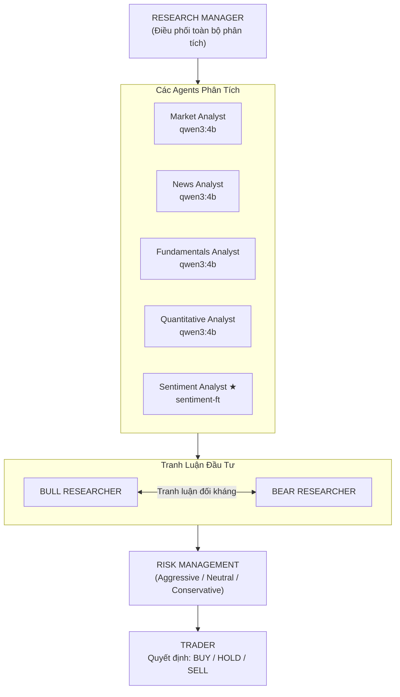
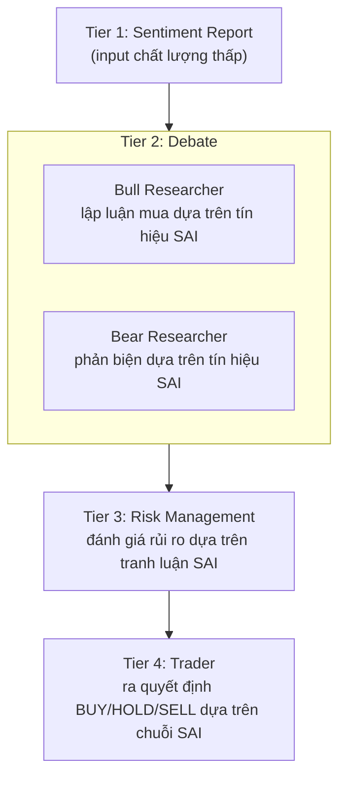
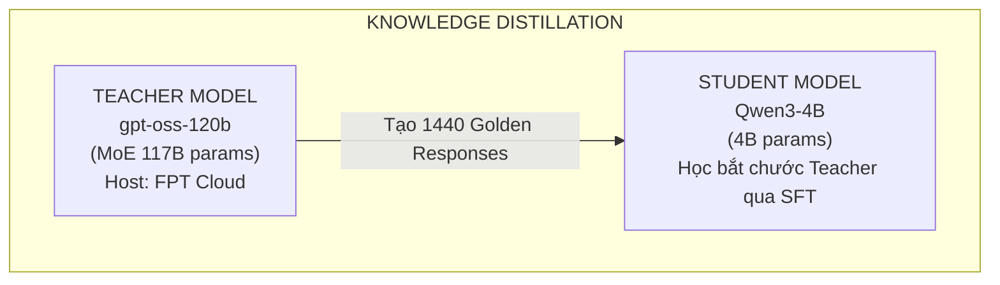
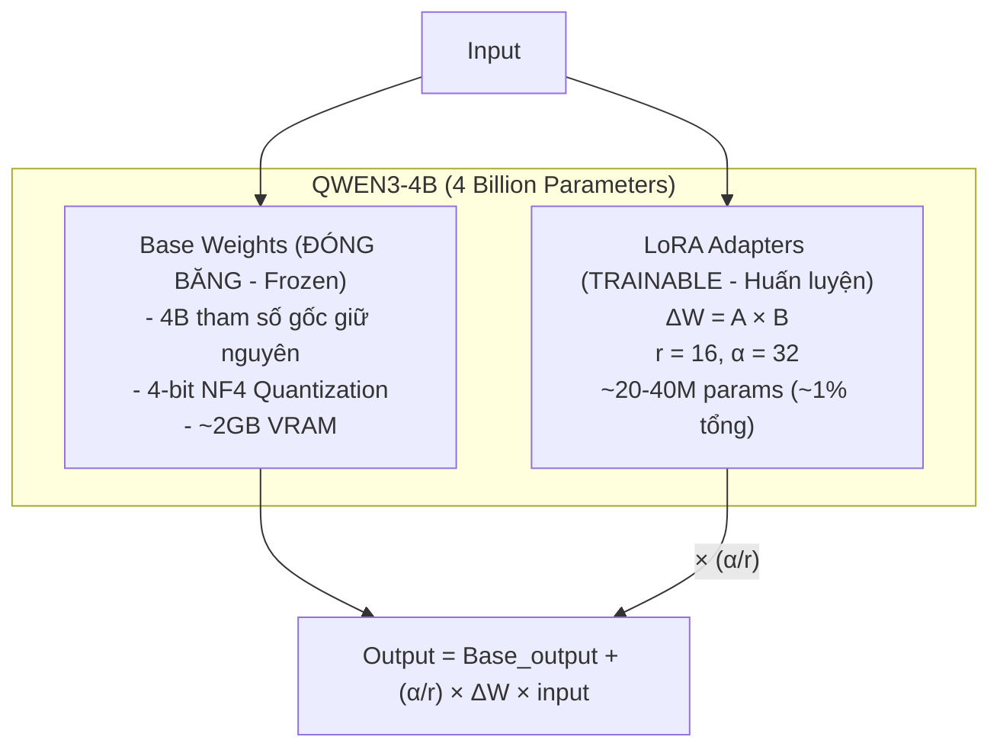
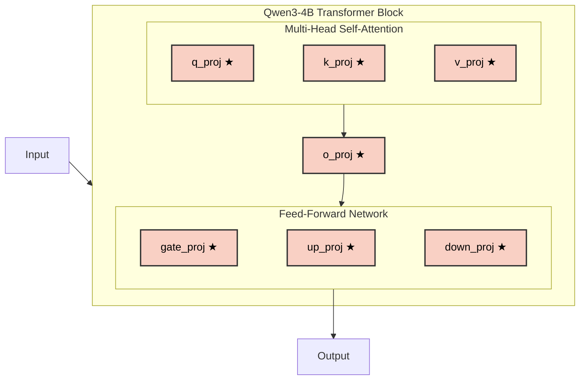
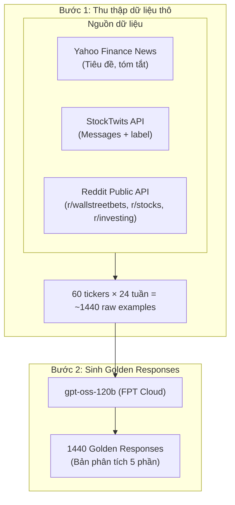
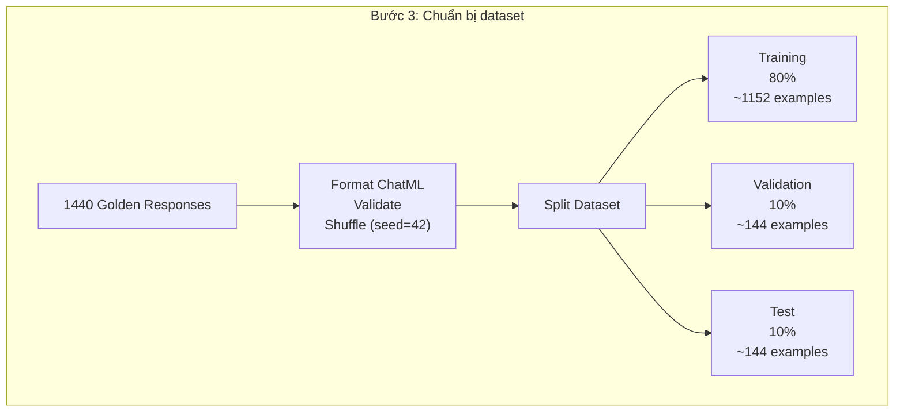
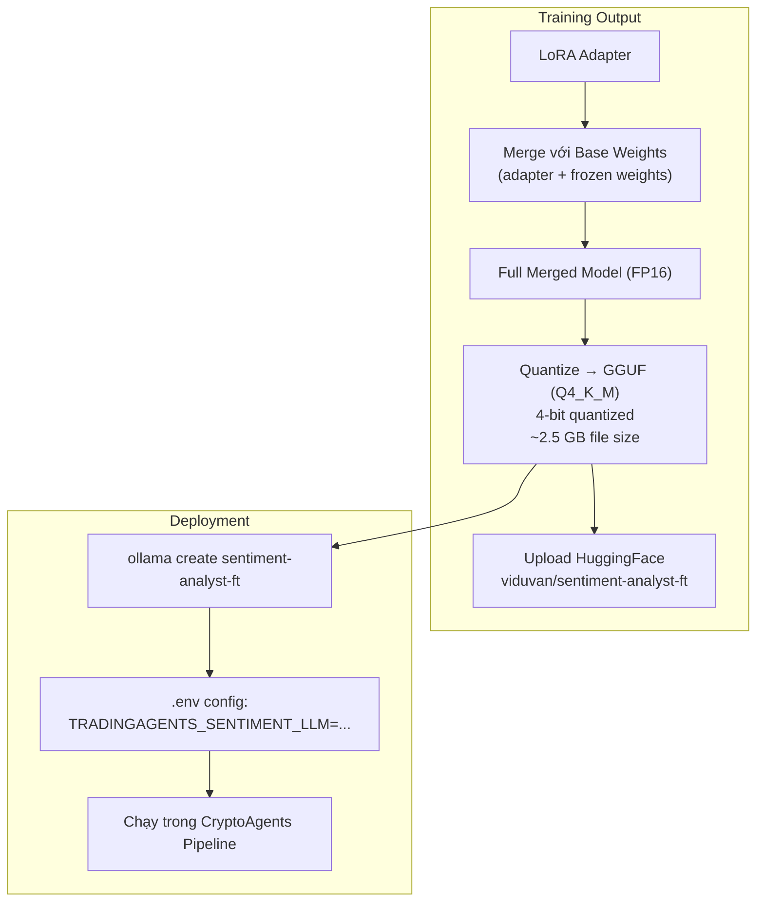
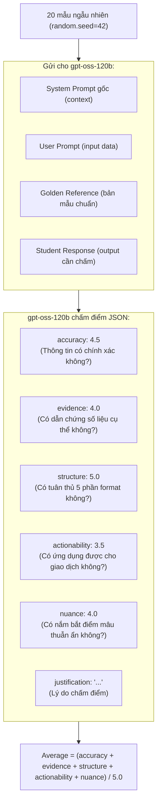

# Nội Dung Thuyết Trình: Fine-Tuning Sentiment Analyst trong Hệ Thống CryptoAgents

> **Dự án**: CryptoAgents — Hệ thống Multi-Agent Trading tự động  
> **Phương pháp**: QLoRA Fine-Tuning với Knowledge Distillation  
> **Model**: Qwen3-4B → sentiment-analyst-ft  
> **Thời gian thực hiện**: ~10 giờ 40 phút – 12 giờ 40 phút  

---

## BỐI CẢNH DỰ ÁN: TỪ CLOUD API ĐẾN LOCAL MODEL VÀ BÀI TOÁN FINE-TUNING

Ban đầu, các hệ thống Multi-Agent thường sử dụng các API LLM thương mại lớn (như GPT-4, Claude) để đảm bảo chất lượng suy luận. Tuy nhiên, khi xây dựng và triển khai thực tế hệ thống **CryptoAgents**, chúng tôi quyết định chuyển sang sử dụng các **model open-source nhỏ (Small Language Models - SLMs) chạy local** vì 3 lý do cốt lõi:

1. **Chi phí vận hành (Cost):** Hệ thống gồm 5 sub-agent hoạt động liên tục, thường xuyên quét và xử lý lượng dữ liệu đầu vào khổng lồ (tin tức, giá, mạng xã hội, báo cáo tài chính). Nếu dùng API trả phí, lượng token tiêu thụ mỗi ngày sẽ tạo ra gánh nặng chi phí khổng lồ, không khả thi để duy trì lâu dài.
2. **Độ trễ và Giới hạn (Latency & Rate Limits):** Việc phụ thuộc vào API bên ngoài làm hệ thống dễ bị ảnh hưởng bởi độ trễ mạng và các giới hạn tốc độ (rate limit) của nhà cung cấp, làm giảm khả năng phản ứng theo thời gian thực của hệ thống giao dịch.
3. **Tính tự chủ (Autonomy):** Việc chạy model local giúp hệ thống hoàn toàn độc lập, hoạt động 24/7 mà không phụ thuộc vào tình trạng server của bên thứ ba.

**Vấn đề phát sinh (The Bottleneck):** 
Để hệ thống có thể chạy mượt mà trên phần cứng phổ thông (VRAM hạn chế), chúng tôi phải chọn model có kích thước nhỏ gọn (cụ thể là **Qwen3-4B**). 
Tuy nhiên, các model nhỏ bộc lộ giới hạn rõ rệt khi đối mặt với các nghiệp vụ phức tạp. Trong khi chúng xử lý khá tốt các tác vụ phân tích số liệu có cấu trúc định sẵn, thì đối với tác vụ **phân tích tâm lý thị trường (Sentiment Analysis)** — vốn đòi hỏi khả năng đọc hiểu ngôn ngữ tự nhiên từ nhiều nguồn phi cấu trúc hỗn loạn (Reddit, StockTwits, News), cross-reference để tìm mâu thuẫn và tổng hợp báo cáo — model nhỏ nguyên bản đã **thất bại nặng nề**.

**➡️ Bài Toán Đặt Ra:** Chúng ta không thể quay lại sử dụng API đắt đỏ, nhưng cũng không thể chấp nhận sai số của model nhỏ nguyên bản. Do đó, giải pháp tối ưu và bắt buộc là phải **Fine-Tune (huấn luyện tinh chỉnh)** model open-source nhỏ này (áp dụng Knowledge Distillation từ model lớn) để nó sở hữu năng lực chuyên sâu cho nghiệp vụ Sentiment Analysis mà vẫn giữ được lợi thế chạy local chi phí thấp!

---

## PHẦN 1: TẠI SAO CHỌN SENTIMENT ANALYST ĐỂ FINE-TUNE?

### 1.1 Kiến Trúc Hệ Thống CryptoAgents

Hệ thống CryptoAgents sử dụng kiến trúc **Multi-Agent** gồm 5 subagent chuyên biệt, mỗi agent đảm nhận một khía cạnh phân tích khác nhau:



### 1.2 Lý Do Chọn Sentiment Analyst — Phân Tích Bottleneck

Trong 5 subagent, **Sentiment Analyst** được lựa chọn để fine-tune vì 3 lý do cốt lõi:

#### ❶ Nghiệp vụ phức tạp nhất — Tổng hợp đa nguồn dữ liệu phi cấu trúc

| Subagent | Nguồn dữ liệu đầu vào | Loại dữ liệu | Độ phức tạp output |
| :--- | :--- | :--- | :--- |
| Market Analyst | Yahoo Finance API (số liệu giá, volume) | **Cấu trúc** (JSON/số) | Trung bình |
| News Analyst | Yahoo Finance News (tiêu đề + tóm tắt) | Bán cấu trúc | Trung bình |
| Fundamentals Analyst | Financial statements (P/E, EPS, Revenue) | **Cấu trúc** (bảng số) | Thấp |
| Quantitative Analyst | OHLCV data, Technical indicators | **Cấu trúc** (số) | Trung bình |
| **Sentiment Analyst ★** | News + StockTwits + Reddit (3 nguồn) | **Phi cấu trúc** (text tự do) | **Cao nhất** |

Sentiment Analyst phải:
- Đọc hiểu **tin tức tài chính** (institutional framing)
- Phân tích **bài viết StockTwits** với label Bullish/Bearish (retail sentiment) 
- Tổng hợp **thảo luận Reddit** từ r/wallstreetbets, r/stocks, r/investing
- **Cross-reference** giữa 3 nguồn để phát hiện divergence/alignment
- Xuất báo cáo có **5 phần bắt buộc** + bảng Markdown tóm tắt

→ Đây là task khó nhất cho model nhỏ 4B chạy local, và cũng là nơi model gốc **thất bại nặng nhất** (31.2% accuracy vs 50%+ của các agent khác).

#### ❷ Điểm yếu rõ ràng nhất của model gốc — Khi không có fine-tuning

Khi chạy model gốc `qwen3:4b` trên tập test, Sentiment Analyst bộc lộ 3 điểm yếu nghiêm trọng:

| Vấn đề | Biểu hiện | Hệ quả |
| :--- | :--- | :--- |
| **Sai hướng sentiment** | Model gốc chỉ đúng 31.2% hướng sentiment (Bullish/Bearish/Neutral/Mixed) | Cung cấp tín hiệu **sai** cho Bull/Bear Researcher → quyết định giao dịch sai |
| **Thiếu cấu trúc** | Output không tuân thủ 5 phần bắt buộc (Structure Score: 0.290/1.0) | Downstream agents không parse được thông tin → mất dữ liệu phân tích |
| **Nội dung lệch** | ROUGE-1 F1 chỉ 0.134 — rất thấp so với golden reference | Văn phong và nội dung không chuyên nghiệp, thiếu bằng chứng cụ thể |

#### ❸ Tác động lan truyền (Cascading Effect) trong hệ thống Multi-Agent

Sentiment Analyst nằm ở **tầng phân tích đầu tiên** (Tier 1), output của nó là **đầu vào trực tiếp** cho tầng tranh luận (Tier 2):



**Hiệu ứng Garbage-In-Garbage-Out**: Khi sentiment report sai ở Tier 1, toàn bộ chuỗi phân tích phía sau đều bị ảnh hưởng. Ngược lại, nếu cải thiện Sentiment Analyst, chất lượng phân tích của **toàn bộ pipeline** được nâng cao.

### 1.3 Lợi Ích Cụ Thể Khi Fine-Tune Sentiment Analyst

| # | Lợi ích | Trước Fine-Tune | Sau Fine-Tune | Tác động lên hệ thống |
| :--- | :--- | :--- | :--- | :--- |
| 1 | **Chính xác hướng sentiment** | 31.2% | **83.3%** (+52.1%) | Bull/Bear Researcher nhận tín hiệu đúng → tranh luận chất lượng hơn |
| 2 | **Chuẩn hóa output** | 0.290 | **0.934** (+0.644) | Downstream agents parse được 5 phần đầy đủ → không mất thông tin |
| 3 | **Nội dung chuyên nghiệp** | 0.134 ROUGE-1 | **0.436** (+0.302) | Báo cáo có bằng chứng, số liệu cụ thể → quyết định giao dịch có cơ sở |
| 4 | **Chi phí thấp** | Phải dùng API cloud (tốn phí) | Model 4B chạy local miễn phí | Giảm chi phí vận hành xuống **$0/tháng** cho sentiment analysis |
| 5 | **Latency thấp** | API cloud ~2-5s/request | Model local ~0.3-0.5s/request | Phân tích realtime, không phụ thuộc mạng |

---

## PHẦN 2: CHI TIẾT PHƯƠNG PHÁP FINE-TUNING

### 2.1 Tổng Quan Phương Pháp: Knowledge Distillation + QLoRA

Phương pháp fine-tuning sử dụng kỹ thuật **Knowledge Distillation** (Chưng cất tri thức) kết hợp **QLoRA** (Quantized Low-Rank Adaptation):



**Tại sao chọn Knowledge Distillation?**
- Model lớn (117B) quá nặng để chạy local → cần "chưng cất" kiến thức vào model nhỏ (4B).
- Student model chỉ cần 4GB VRAM để inference → triển khai trên máy local không cần GPU đắt tiền.

> [!NOTE] 
> **Cơ sở Toán học & Phương pháp (Black-box KD / Sequence-Level KD)**
> Khác với KD truyền thống (tính KL-Divergence trên soft-logits của Teacher), với LLM thế hệ mới qua API, ta áp dụng **Black-box KD**. Teacher model chỉ cung cấp *hard labels* (văn bản text đầu ra — Golden Responses).
> 
> Hàm mục tiêu của Student trở thành Standard Causal Language Modeling Loss (Cross-Entropy) học theo phân phối từ của Teacher:
> 
> $$
> \mathcal{L}_{SFT} = - \sum_{i=1}^{N} \log P_{\theta}(y_i | x, y_{<i})
> $$
> 
> *Trong đó:*
> - $x$: Input (Tin tức tổng hợp, StockTwits, Reddit)
> - $y$: Golden Response sinh bởi Teacher (gpt-oss-120b)
> - $\theta$: Trọng số mạng nơ-ron của Student Model (Qwen3-4B)

> [!TIP]
> **Ví Dụ Tính Toán Cụ Thể (Hàm Cross-Entropy)**
> 
> Giả sử Teacher nhận định xong và yêu cầu Student xuất ra 2 tokens: $y_1=$ `"Buy"`, $y_2=$ `"NVDA"`.
> 
> 1. **Dự đoán Token 1:** Dựa vào bài báo $x$, Student dự đoán từ `"Buy"` với xác suất **80%** ($P=0.8$).
>    $\rightarrow$ **Loss 1** $= -\log(0.8) \approx 0.223$
> 
> 2. **Dự đoán Token 2:** Dựa vào bài báo $x$ và từ `"Buy"`, Student dự đoán từ `"NVDA"` với xác suất **50%** ($P=0.5$).
>    $\rightarrow$ **Loss 2** $= -\log(0.5) \approx 0.693$
> 
> **Tổng Loss chuỗi:** $\mathcal{L}_{SFT} = 0.223 + 0.693 = \mathbf{0.916}$. Quá trình Train sẽ dùng đạo hàm để tinh chỉnh trọng số mạng nơ-ron, ép xác suất của "Buy NVDA" tăng dần lên 100% (Loss $\rightarrow 0$).

> [!NOTE]
> **Toán Học Của Việc Cập Nhật Trọng Số (Gradient Descent)**
> 
> Làm sao mô hình biết phải sửa trọng số nào để Loss giảm? Chìa khóa nằm ở **Đạo hàm (Gradient)**.
> Dựa vào ví dụ Bước 1 ở trên, giả sử từ điển chỉ có 2 từ là `"Buy"` và `"Sell"`. Mô hình đưa ra xác suất: $P(\text{"Buy"}) = 0.8$, $P(\text{"Sell"}) = 0.2$. Từ mục tiêu (Target) là `"Buy"`.
> 
> Đạo hàm của hàm Cross-Entropy kết hợp Softmax theo điểm số đầu ra (logits) có một công thức cực kỳ tối giản:
> **$\text{Gradient} = \text{Xác suất Dự đoán} - \text{Thực tế}$**
> 
> - Với từ đúng `"Buy"` (Thực tế = 1): Gradient $= 0.8 - 1 = \mathbf{-0.2}$
> - Với từ sai `"Sell"` (Thực tế = 0): Gradient $= 0.2 - 0 = \mathbf{+0.2}$
> 
> **Ý nghĩa của con số này:**
> - Gradient **âm** ($-0.2$): Báo hiệu mạng nơ-ron cần phải **TĂNG** điểm số của từ `"Buy"` lên.
> - Gradient **dương** ($+0.2$): Báo hiệu mạng nơ-ron cần phải **GIẢM** điểm số của từ `"Sell"` xuống.
> 
> Thuật toán Lan truyền ngược (Backpropagation) sẽ truyền các Gradient này ngược về các lớp bên dưới. Trọng số (weights) $W$ chi phối trực tiếp đến các từ này sẽ được cập nhật theo công thức: 
> 
> $$
> W_{mới} = W_{cũ} - \eta \times \text{Gradient}
> $$
> 
> *(Với $\eta$ là Learning Rate)*. Vì Gradient của `"Buy"` là số âm, khi trừ đi số âm sẽ thành phép cộng $\rightarrow$ Trọng số của `"Buy"` được tăng lên. Ở lần huấn luyện tiếp theo, xác suất dự đoán `"Buy"` sẽ tăng từ $0.8$ lên $0.85$, $0.90$... dần tiến tới $1.0$.

> [!TIP]
> **Ví dụ Tính Toán Hiệu Quả Chi Phí (ROI) của Distillation**
> - **Chi phí "Chưng cất" (Tạo 1440 mẫu Golden Dataset)**:
>   - 1440 samples × ~1,500 tokens/sample = **~2.16 triệu tokens**.
>   - Với giá API khoảng $1/1M tokens → **Chi phí 1 lần duy nhất: ~$2.16**.
> - **Chi phí Vận hành (Nếu KHÔNG dùng KD, phải gọi trực tiếp API)**:
>   - Giả sử hệ thống phân tích 60 tickers × 7 ngày × 52 tuần = 21,840 reports/năm.
>   - Tổng tokens cần sinh: 21,840 × 1,500 = **32.7 triệu tokens**.
>   - Chi phí API hàng năm: **~$32.7/năm** (Và còn tăng lên nếu tăng tần suất, kèm độ trễ 2-5s/request).
> - **Kết luận**: Bỏ ra ~$2 ban đầu tạo dữ liệu huấn luyện, ta thu được model chạy offline trọn đời với chi phí **$0** và tốc độ phản hồi cực nhanh (~0.3s).

### 2.2 QLoRA — Phương Pháp Fine-Tuning Hiệu Quả

**QLoRA** (Quantized Low-Rank Adaptation) là phương pháp fine-tuning tiết kiệm tài nguyên nhất hiện nay:

#### Cơ chế hoạt động:


> 
> **Diễn giải chi tiết biểu đồ QLoRA:**
> 1. **Tách nhánh dữ liệu:** Khi có dữ liệu đầu vào (Input), luồng xử lý được chia làm 2 nhánh chạy song song.
> 2. **Nhánh Base (Não bộ gốc):** Chứa 4 Tỷ tham số nguyên bản của mô hình Qwen3-4B. Toàn bộ trọng số ở đây bị **Đóng băng (Frozen)** hoàn toàn và được ép xuống định dạng 4-bit (NF4). Điều này giúp mô hình không bao giờ bị quên kiến thức cũ, đồng thời tiết kiệm tối đa VRAM (chỉ tốn ~2GB thay vì 8GB).
> 3. **Nhánh LoRA (Mô-đun học mới):** Là một mạng nơ-ron thu nhỏ chạy song song, sử dụng 2 ma trận nhỏ $A$ và $B$ để tính toán sự thay đổi $\Delta W$. Nhánh này liên tục được huấn luyện và cập nhật bằng toán học đạo hàm, nhưng nó siêu nhẹ vì chỉ chiếm **~1%** tổng số tham số (~20-40M params).
> 4. **Khuếch đại (Scaling):** Trước khi hợp nhất, kết quả học được từ LoRA sẽ được nhân với hệ số khuếch đại $(\frac{\alpha}{r})$ nhằm nhấn mạnh các tín hiệu tài chính mới mà nó vừa học được.
> 5. **Hợp nhất (Output):** Kết quả cuối cùng là sự cộng gộp giữa tư duy ngôn ngữ chung của "Não bộ gốc" và những kiến thức tài chính chuyên sâu vừa được học từ "LoRA".

#### Tại sao chọn QLoRA thay vì Full Fine-Tuning?

| Tiêu chí | Full Fine-Tuning | QLoRA |
| :--- | :--- | :--- |
| **Số params cần train** | 4B (100%) | ~20-40M (**~1%**) |
| **VRAM cần thiết** | ~32-64 GB (A100 80GB) | **~8-12 GB** (T4 16GB đủ) |
| **Thời gian train** | 12-24 giờ | **~2.5 giờ** |
| **Chi phí GPU** | ~$50-100 (A100) | **~$5-10** (T4 trên Colab Pro) |
| **Rủi ro Catastrophic Forgetting**| Cao (thay đổi toàn bộ weights) | **Thấp** (weights gốc frozen) |
| **Hiệu năng** | Tốt nhất | **95-99%** so với full FT |

> [!NOTE]
> **Ví Dụ Cụ Thể: Toán Học Giảm Tham Số Của LoRA**
> 
> Giả sử ta muốn cập nhật một ma trận Attention Weight (ví dụ `q_proj`) có kích thước $\Delta W \in \mathbb{R}^{d \times d}$, với chiều ẩn $d = 4096$.
> 
> **1. Full Fine-Tuning:**
> - Cần huấn luyện và cập nhật ma trận có kích thước $4096 \times 4096$.
> - Số lượng tham số (Parameters) = $4096 \times 4096 =$ **16,777,216** (~16.7 triệu tham số).
> 
> **2. Dùng LoRA (với Rank $r = 16$):**
> - Phân tách $\Delta W = A \times B$.
> - Ma trận hạ chiều $A \in \mathbb{R}^{4096 \times 16}$ $\rightarrow$ có $4096 \times 16 =$ **65,536** tham số.
> - Ma trận tái chiều $B \in \mathbb{R}^{16 \times 4096}$ $\rightarrow$ có $16 \times 4096 =$ **65,536** tham số.
> - Tổng tham số LoRA cần huấn luyện: $65,536 + 65,536 =$ **131,072** tham số.
> 
> **Kết quả:**
> - Tỷ lệ tiết kiệm: $131,072 \div 16,777,216 \approx 0.0078$ (**Chỉ train 0.78% tham số của module đó!**).
> - Tính toán đạo hàm, ma trận gradient và bộ nhớ lưu trữ AdamW optimizer giảm đi 128 lần.

> [!TIP]
> **Ví Dụ Tính Toán Mức Tiêu Thụ VRAM (4-bit Quantization)**
> 
> Đối với Model Base có quy mô **4 tỷ tham số (4B)**:
> 
> - **Nếu dùng Full Fine-Tuning (FP16):**
>   - Base Model Weights: 4B × 2 bytes/param = **8 GB VRAM**.
>   - Optimizer States (Adam) & Gradients: ~3 × 8GB = **24 GB VRAM**.
>   - **Tổng cộng: ~32 GB VRAM** (Vượt quá card thông thường, bắt buộc phải thuê A100/V100 40GB).
> 
> - **Nếu dùng QLoRA (NF4 4-bit kết hợp LoRA):**
>   - Base Model Weights (Đóng băng & Quantized 4-bit): 4B × 0.5 bytes = **2 GB VRAM**.
>   - LoRA Adapters (~40M tham số train dạng FP16): ~40M × 2 bytes = **80 MB**.
>   - Optimizer States (Adam 8-bit riêng cho LoRA): ~80MB × 2 = **160 MB**.
>   - Context Memory (bộ nhớ cho activations): **~2-4 GB** tùy độ lớn batch.
>   - **Tổng cộng: ~4.5 - 6 GB VRAM** (Vừa vặn trên các card tiêu chuẩn như Google Colab T4 16GB hoặc card cá nhân RTX 3060 12GB).

### 2.3 Cấu Hình Huấn Luyện Chi Tiết

#### Training Configuration:

```python
# === Model Configuration ===
BASE_MODEL    = "Qwen/Qwen3-4B"        # Model nền từ HuggingFace
QUANTIZATION  = "4-bit NF4"             # Lượng tử hóa NormalFloat 4-bit
MAX_SEQ_LEN   = 4096                     # Chiều dài chuỗi tối đa (tokens)

# === LoRA Configuration ===
LORA_R        = 16                       # Rank — số chiều adapter
LORA_ALPHA    = 32                       # Scaling factor (thường = 2 × r)
LORA_DROPOUT  = 0.05                     # Dropout regularization (5%)
TARGET_MODULES = [                       # 7 loại ma trận được gắn adapter
    "q_proj",    # Query projection  (Attention)
    "k_proj",    # Key projection    (Attention)
    "v_proj",    # Value projection  (Attention)
    "o_proj",    # Output projection (Attention)
    "gate_proj", # Gate projection   (MLP/FFN)
    "up_proj",   # Up projection     (MLP/FFN)
    "down_proj"  # Down projection   (MLP/FFN)
]

# === Training Hyperparameters ===
BATCH_SIZE      = 4                      # Batch size per device
GRAD_ACCUM      = 4                      # Gradient accumulation steps
EFFECTIVE_BATCH = 4 × 4 = 16            # Effective batch size
LEARNING_RATE   = 2e-4                   # Learning rate (AdamW 8-bit)
EPOCHS          = 5                      # Số epoch huấn luyện
WARMUP_RATIO    = 0.05                   # 5% steps đầu warmup
SCHEDULER       = "cosine"               # Cosine annealing LR schedule
WEIGHT_DECAY    = 0.01                   # L2 regularization

# === Framework ===
FRAMEWORK = "Unsloth + TRL SFTTrainer"  # Thư viện tối ưu hóa tốc độ train
PLATFORM  = "Google Colab Pro"           # GPU: T4/L4/A100 (auto-detect)
```

#### Giải thích các Target Modules:



> [!NOTE]
> **Giải Mã 7 Loại Ma Trận (Target Modules) Được Gắn LoRA Adapter**
> 
> Trong kiến trúc Qwen3-4B, mỗi Transformer Block chứa 7 ma trận tuyến tính (Linear layer) cốt lõi chi phối toàn bộ khả năng hiểu và sinh ngôn ngữ. Việc gắn LoRA vào **TẤT CẢ 7 loại ma trận này (phương pháp all-linear)** thay vì chỉ `q_proj` và `v_proj` như tiêu chuẩn cũ, giúp model học được các suy luận logic phức tạp của ngành tài chính với độ chính xác cao hơn rất nhiều.

#### 1. Nhóm Ma Trận Attention (Nơi Model "Tập Trung" Sự Chú Ý)
Cơ chế Multi-Head Self-Attention quyết định việc model liên kết các từ trong câu với nhau ra sao. Công thức cốt lõi: $\text{Attention}(Q,K,V) = \text{softmax}\left(\frac{QK^T}{\sqrt{d_k}}\right)V$.
- **`q_proj` (Query - Câu hỏi)**: Đại diện cho "token hiện tại đang tìm kiếm thông tin gì?". Gắn LoRA giúp model điều chỉnh cách đặt câu hỏi tinh tế hơn (vd: khi đọc từ "NVDA", model sẽ tự động sinh Query tìm kiếm các từ khóa "earnings", "partnership" ở xung quanh).
- **`k_proj` (Key - Chìa khóa)**: Đại diện cho "token này đang chứa đựng thông tin gì để trả lời cho token khác?". Gắn LoRA giúp model tinh chỉnh lại các "nhãn" thông tin để khớp với Query chuẩn xác hơn.
- **`v_proj` (Value - Giá trị)**: Giá trị thực sự được trích xuất nếu Query và Key khớp nhau. Việc gắn LoRA ở đây vô cùng quan trọng để mô hình cập nhật trực tiếp nội dung ngữ nghĩa mới (vd: nhận định "priced in" là một tín hiệu Bearish tiềm ẩn).
- **`o_proj` (Output - Tổng hợp)**: Tổng hợp thông tin từ nhiều Attention Heads lại thành một vector duy nhất. Gắn LoRA giúp tinh chỉnh cách model "chốt lại" ngữ cảnh trước khi đẩy sang mạng nơ-ron suy luận tiếp theo.

#### 2. Nhóm Ma Trận FFN (Nơi Model "Lưu Trữ Tri Thức" & "Suy Luận")
Mạng Feed-Forward Network (FFN) sử dụng kiến trúc SwiGLU. Đây là nơi chứa >60% tham số của model và đóng vai trò như "bộ nhớ tri thức".
- **`gate_proj` (Cổng vào)**: Đóng vai trò như một bộ lọc (filter) kết hợp với hàm kích hoạt SiLU. Gắn LoRA giúp model học cách "mở cổng" cho các tín hiệu tài chính quan trọng và chặn các tín hiệu nhiễu (noise) từ mạng xã hội.
- **`up_proj` (Khai triển)**: Phóng to số chiều của dữ liệu lên (thường gấp 3-4 lần) để mô hình có không gian tư duy rộng hơn, kết nối nhiều khái niệm phức tạp (như liên hệ giữa Lãi suất FED và Giá Crypto).
- **`down_proj` (Thu gọn)**: Nén dữ liệu từ không gian chiều cao về lại không gian chiều gốc (VD: $d=4096$) để truyền sang block tiếp theo. Gắn LoRA giúp tinh chỉnh trực tiếp "kết luận" của mạng FFN.

> [!TIP]
> **Ví Dụ Tính Toán Cụ Thể (Attention Matrix `v_proj`)**
> 
> Lấy ma trận `v_proj` có kích thước: **(Input) 4096 × (Output) 4096**.
> Khi có 1 token đầu vào (dạng vector $x \in \mathbb{R}^{1 \times 4096}$) đi qua module này:
> 
> 1. **Nếu KHÔNG có LoRA:** 
>    $h_{base} = x \cdot W_{base}$
>    *(Mô hình sử dụng trí tuệ nguyên bản, nhân với ma trận 16.7 triệu tham số đã bị khóa/frozen).*
> 
> 2. **Khi GẮN LoRA (với Rank $r=16$, Alpha $\alpha=32$):**
>    Luồng dữ liệu rẽ làm 2 nhánh và tính toán song song:
>    - **Nhánh 1 (Gốc):** $h_{base} = x \cdot W_{base}$ 
>    - **Nhánh 2 (LoRA):** 
>      - Cấu trúc: $y_{lora} = (x \cdot A) \cdot B$
>      - **Hạ chiều:** $x' = x \cdot A$ (nhân ma trận $4096 \times 16$). Quá trình này nén vector $4096$ chiều xuống $16$ chiều. *Ý nghĩa: Ép model loại bỏ thông tin thừa, chỉ giữ lại những "ý chính" cốt lõi nhất của bài báo.*
>      - **Tái chiều:** $y_{lora} = x' \cdot B$ (nhân ma trận $16 \times 4096$). Giải nén từ $16$ chiều về lại không gian $4096$ chiều.
>      - **Scaling:** $y_{lora\_scaled} = y_{lora} \times \left(\frac{\alpha}{r}\right) = y_{lora} \times \left(\frac{32}{16}\right) = y_{lora} \times 2$. *(Khuếch đại tín hiệu mới học được lên gấp đôi để tác động mạnh hơn).*
>    
> 3. **Tổng hợp (Output cuối cùng):**
>    $h_{final} = h_{base} + y_{lora\_scaled}$
> 
> **Hình ảnh trực quan (Analogy):** 
> Giống như việc bạn có một cuốn bách khoa toàn thư đã in đóng bìa cứng ($W_{base}$). Bạn không thể tẩy xóa chữ in (Frozen), nên bạn viết những kiến thức tài chính mới vào một tờ giấy note nhỏ dán vào rìa trang sách (Ma trận $A$ và $B$). Khi đọc trang sách đó ($h_{final}$), bạn sẽ tự động tiếp thu cả kiến thức cũ trong sách cộng với ghi chú mới mẻ, cập nhật của mình!

### 2.4 Dữ Liệu Huấn Luyện

#### Quy trình chuẩn bị dữ liệu (Data Pipeline):



#### 5 Phần Bắt Buộc Trong Mỗi Golden Response

Model Teacher (`gpt-oss-120b`) sinh ra mỗi Golden Response theo cấu trúc **5 phần bắt buộc** — đây chính là "khuôn mẫu vàng" mà Student model phải học theo:

> ## CẤU TRÚC GOLDEN RESPONSE (5 PHẦN)
> 
> ### PHẦN 1: Overall Sentiment Direction (Hướng đi tổng thể)
> - **Mục đích**: Kết luận tổng quan — thị trường đang Bullish, Bearish, Neutral hay Mixed? Kèm ghi chú độ tin cậy dựa trên chất lượng và số lượng dữ liệu đầu vào.
> - **Ví dụ output**:
>   > "## Overall Sentiment Direction: **Bullish**
>   > Confidence: Moderate-High. Based on 12 news articles, 30 StockTwits messages (75% bullish), and 8 Reddit threads with active discussion."
>
> ### PHẦN 2: Source-by-Source Breakdown (Phân tích chi tiết từng nguồn)
> - **Mục đích**: Phân tích riêng biệt từng nguồn dữ liệu, chỉ ra mỗi nguồn "nói gì" với bằng chứng cụ thể (số liệu, trích dẫn).
> - **3 nguồn được phân tích**:
>   - 📰 **News (Yahoo Finance)**: Institutional framing, sự kiện chính
>   - 💬 **StockTwits**: Tỷ lệ Bullish/Bearish, trend retail
>   - 🗣️ **Reddit**: Thảo luận cộng đồng, engagement score
> - **Ví dụ output**:
>   > "### News (Yahoo Finance)
>   > 12 articles found. 8 positive (67%), 3 neutral, 1 negative. Key headlines: 'NVDA partners with Corning on $500M deal'...
>   > 
>   > ### StockTwits
>   > 30 messages sampled. Bullish: 22 (73%), Bearish: 5 (17%)...
>   > 
>   > ### Reddit
>   > 8 posts across r/wallstreetbets (3), r/stocks (4), r/investing (1). Top post: 'NVDA earnings beat expectations' (↑340, 198 comments)."
>
> ### PHẦN 3: Divergences, Alignments & Key Narratives (Phân kỳ, đồng thuận & câu chuyện chủ đạo)
> - **Mục đích**: Cross-reference giữa 3 nguồn — các nguồn có đồng thuận hay mâu thuẫn nhau? Xác định narrative chủ đạo đang chi phối thị trường.
> - **Ví dụ output**:
>   > "## Divergences & Alignments
>   > **Alignment**: News và StockTwits đồng thuận bullish — tin tức tích cực về partnership được retail đón nhận nhiệt tình.
>   > 
>   > **Divergence**: Reddit r/wallstreetbets có tone thận trọng hơn, một số post cảnh báo 'priced in' với valuation P/E >40. Đây là tín hiệu contrarian — retail social media bullish nhưng cộng đồng thảo luận sâu hơn thì hoài nghi.
>   > 
>   > **Key Narrative**: AI infrastructure spending là câu chuyện chủ đạo, xuất hiện ở cả 3 nguồn."
>
> ### PHẦN 4: Catalysts & Risks (Chất xúc tác & Rủi ro)
> - **Mục đích**: Liệt kê các sự kiện/yếu tố có thể đẩy giá lên (catalysts) hoặc kéo giá xuống (risks) trong thời gian tới.
> - **Ví dụ output**:
>   > "## Catalysts & Risks
>   > **Catalysts (Tăng giá):**
>   > - Earnings report Q2 dự kiến 28/06 — consensus beat kỳ vọng
>   > - Partnership mới với Corning ($500M)
>   > - AI inference demand tăng trưởng 40% YoY
>   > 
>   > **Risks (Giảm giá):**
>   > - Valuation cao (P/E >40), rủi ro 'priced in'
>   > - Quy định xuất khẩu chip mới sang Trung Quốc
>   > - Cạnh tranh từ AMD MI300X tăng market share"
>
> ### PHẦN 5: Markdown Summary Table (Bảng tổng hợp tín hiệu)
> - **Mục đích**: Bảng Markdown tóm tắt toàn bộ tín hiệu sentiment ở dạng có cấu trúc — giúp downstream agents (Bull/Bear Researcher) dễ dàng parse và trích xuất thông tin.
> - **Ví dụ output**:
>   > | Signal          | Direction | Source     | Evidence              |
>   > |:----------------|:----------|:-----------|:----------------------|
>   > | News Framing    | Bullish   | Yahoo Fin. | 67% positive articles |
>   > | Retail Sentiment| Bullish   | StockTwits | 73% bullish messages  |
>   > | Community Mood  | Mixed     | Reddit     | WSB cautious, r/stocks positive |
>   > | Upcoming Event  | Catalyst  | All Sources| Earnings 28/06        |
>   > | Valuation Risk  | Bearish   | Reddit     | P/E >40 concerns      |
>
> ---
> **Tại sao phải có đúng 5 phần?**
> - Downstream agents (Bull/Bear Researcher) cần parse output có cấu trúc.
> - Nếu thiếu phần nào, thông tin bị mất → phân tích không đầy đủ.
> - **Structure Score** đo chính xác: `score = (số phần có) / 5.0`

#### Quy trình chuẩn bị dữ liệu (Data Pipeline):



#### Định dạng dữ liệu — ChatML (Qwen3 Native):

```json
{
  "messages": [
    {
      "role": "system",
      "content": "You are a helpful AI assistant... [System prompt + Sentiment Analyst instructions + 3 data blocks]"
    },
    {
      "role": "user", 
      "content": "Continue"
    },
    {
      "role": "assistant",
      "content": "[Golden Response từ gpt-oss-120b — bản phân tích 5 phần hoàn chỉnh]"
    }
  ]
}
```

### 2.5 Quy Trình Triển Khai Sau Training



---

## PHẦN 3: ĐÁNH GIÁ SO SÁNH TRƯỚC VÀ SAU FINE-TUNING

### 3.1 Bảng So Sánh Kết Quả Thực Tế

Kết quả benchmark trên **144 mẫu test** (trùng nhau hoàn toàn giữa 2 model, đảm bảo công bằng):

| Chỉ số | Baseline (`qwen3:4b`) | Fine-Tuned (`sentiment-analyst-ft`) | Độ lệch (Δ) | Đạt ngưỡng? |
| :--- | :---: | :---: | :---: | :---: |
| **Sentiment Accuracy** | 31.2% | **83.3%** | 📈 **+52.1%** | ✅ ≥70% |
| **Structure Score** | 0.290 | **0.934** | 📈 **+0.644** | ✅ ≥0.80 |
| **ROUGE-1 F1** | 0.134 | **0.436** | 📈 **+0.302** | ✅ ≥0.35 |
| **GPT-as-Judge** | 1.70/5.0 | **2.99/5.0** | 📈 **+1.293** | ⚠️ ≈3.0 (sát ngưỡng) |

### 3.2 Giải Thích Chi Tiết Từng Chỉ Số Cốt Lõi

---

#### 📊 Chỉ Số 1: Sentiment Accuracy (Độ Chính Xác Phân Loại Sentiment)

**Mục đích**: Đo khả năng model xác định đúng **hướng đi tổng thể** của sentiment (Bullish / Bearish / Neutral / Mixed).

**Cách tính**:

```
                    Số mẫu khớp hướng với Golden Response
Accuracy = ──────────────────────────────────────────────── × 100%
                    Tổng số mẫu test (144)
```

**Quy trình trích xuất**:

```python
def extract_sentiment_direction(response_text):
    """
    Thuật toán trích xuất hướng sentiment theo 4 bước ưu tiên:
    """
    
    # Bước 1 (Ưu tiên cao nhất): Tìm pattern chính xác
    # Ví dụ: "Overall Sentiment Direction: **Bullish**"
    patterns = [
        r"overall sentiment direction\s*:\s*\**bullish\**",
        r"sentiment direction\s*:\s*\**bearish\**",
        ...
    ]
    
    # Bước 2: Quét các dòng ngay sau heading
    # Nếu tìm thấy dòng chứa "overall sentiment direction",
    # kiểm tra 3 dòng tiếp theo để tìm keyword
    
    # Bước 3: Kiểm tra 300 ký tự đầu tiên
    # Tìm keyword đầu tiên xuất hiện (in đậm hoặc in nghiêng)
    
    # Bước 4 (Fallback): Đếm tần suất xuất hiện
    # Keyword nào xuất hiện nhiều nhất → chọn keyword đó
    
    return sentiment_direction  # "Bullish" | "Bearish" | "Neutral" | "Mixed"
```

**So sánh minh họa**:

| | Golden Reference | Baseline Output | Fine-Tuned Output |
| :--- | :--- | :--- | :--- |
| **BTC-USD** | Bullish | ❌ Mixed (sai) | ✅ Bullish (đúng) |
| **NVDA** | Bearish | ❌ Neutral (sai) | ✅ Bearish (đúng) |
| **DOGE-USD** | Mixed | ❌ Bullish (sai) | ✅ Mixed (đúng) |

**Tại sao Baseline chỉ đạt 31.2%?** → Model gốc `qwen3:4b` không được train đặc thù cho task sentiment analysis tài chính. Nó thường:
- Bị chi phối bởi một nguồn duy nhất (chỉ đọc StockTwits, bỏ qua News và Reddit)
- Không biết cross-reference giữa các nguồn
- Mặc định thiên về "Neutral" hoặc "Mixed" khi không chắc chắn

---

#### 📐 Chỉ Số 2: Structure Score (Điểm Cấu Trúc Báo Cáo)

**Mục đích**: Đo xem output của model có tuân thủ đúng **5 phần bắt buộc** của báo cáo sentiment hay không.

**5 thành phần được kiểm tra**:

> **BÁO CÁO SENTIMENT (5 THÀNH PHẦN KIỂM TRA)**
>
> 1. **Overall Sentiment Direction** *(Bullish/Bearish/Neutral/Mixed)*
>    - Keywords: `sentiment direction`, `overall sentiment`
> 2. **Source-by-Source Breakdown** *(Phân tích từng nguồn)*
>    - Keywords: `breakdown`, `source-by-source`
> 3. **Divergence/Alignment Analysis** *(So sánh giữa các nguồn)*
>    - Keywords: `divergence`, `alignment`, `mismatch`
> 4. **Catalysts & Risks** *(Yếu tố tác động & rủi ro)*
>    - Keywords: `catalyst`, `risk`, `threat`, `trigger`
> 5. **Markdown Summary Table** *(Bảng tóm tắt)*
>    - Detection: Có chứa ký tự `|` và `-` (định dạng bảng markdown)

**Cách tính**:

```
                Số thành phần xuất hiện trong output
Structure Score = ──────────────────────────────────────
                              5.0
```

| Ví dụ | ① | ② | ③ | ④ | ⑤ | Score |
| :--- | :---: | :---: | :---: | :---: | :---: | :---: |
| Baseline (điển hình) | ✅ | ❌ | ❌ | ❌ | ✅ | **0.4** |
| Fine-Tuned (điển hình) | ✅ | ✅ | ✅ | ✅ | ✅ | **1.0** |

**Tại sao Baseline chỉ đạt 0.290?** → Model gốc thường chỉ viết 1-2 đoạn tóm tắt ngắn, không tuân thủ cấu trúc 5 phần. Nó thiếu khả năng "tuân thủ format" (instruction following) cho task cụ thể này.

---

#### 📝 Chỉ Số 3: ROUGE (Recall-Oriented Understudy for Gisting Evaluation)

**Mục đích**: Đo lường **độ tương đồng nội dung** giữa output của model và Golden Response (bản mẫu chuẩn từ Teacher model).

**3 biến thể ROUGE sử dụng**:

```
ROUGE-1: Đo trùng khớp từ đơn (unigram)
─────────────────────────────────────────
Golden:   "StockTwits sentiment is overwhelmingly bullish at 75%"
Model FT: "StockTwits shows bullish sentiment at approximately 75%"
                                  ↑           ↑              ↑
                              Khớp từ     Khớp từ        Khớp từ

Precision = Từ khớp trong FT output / Tổng từ FT output
Recall    = Từ khớp trong FT output / Tổng từ Golden Reference
F1        = 2 × (Precision × Recall) / (Precision + Recall)


ROUGE-2: Đo trùng khớp cặp từ liền kề (bigram)
─────────────────────────────────────────────────
Golden:   "bullish sentiment" | "sentiment at" | "at 75%"
Model FT: "bullish sentiment" | "sentiment at" | "at approximately"
              ↑ Khớp bigram       ↑ Khớp bigram


ROUGE-L: Chuỗi chung dài nhất (Longest Common Subsequence)
───────────────────────────────────────────────────────────
Golden:   "The   overall   sentiment   is   moderately   bullish"
Model FT: "The   sentiment   analysis   indicates   moderately   bullish"
           ↑                 ↑                        ↑          ↑
           LCS: ["The", "sentiment", "moderately", "bullish"] → length = 4

ROUGE-L = LCS_length / max(len_golden, len_model)
```

**Thư viện sử dụng**: `rouge_score` (Google Research)

```python
from rouge_score import rouge_scorer

scorer = rouge_scorer.RougeScorer(['rouge1', 'rouge2', 'rougeL'], use_stemmer=True)
                                                                  # ↑ Stemming: "running" → "run"
                                                                  #   để tăng recall khi so sánh

scores = scorer.score(golden_reference, model_output)
# scores['rouge1'].fmeasure → ROUGE-1 F1 Score
# scores['rouge2'].fmeasure → ROUGE-2 F1 Score
# scores['rougeL'].fmeasure → ROUGE-L F1 Score
```

**Kết quả ROUGE chi tiết**:

| Biến thể | Baseline | Fine-Tuned | Ý nghĩa |
| :--- | :---: | :---: | :--- |
| ROUGE-1 F1 | 0.134 | **0.436** | FT sử dụng ~44% từ vựng chuyên ngành giống Teacher |
| ROUGE-2 F1 | (thấp) | (cao hơn) | FT có cấu trúc câu mạch lạc hơn |
| ROUGE-L F1 | (thấp) | (cao hơn) | FT sắp xếp thông tin theo thứ tự logic giống Teacher |

---

#### 🧑‍⚖️ Chỉ Số 4: GPT-as-Judge (Đánh Giá Bằng Trọng Tài GPT)

**Mục đích**: Đánh giá **chất lượng tổng thể** của báo cáo bằng một model lớn (`gpt-oss-120b`) đóng vai trọng tài độc lập.

**Quy trình**:



**5 tiêu chí đánh giá chi tiết**:

| # | Tiêu chí | Điểm 1 (Kém) | Điểm 3 (Trung bình) | Điểm 5 (Xuất sắc) |
| :--- | :--- | :--- | :--- | :--- |
| 1 | **Accuracy** | Sentiment sai hoàn toàn | Đúng hướng nhưng thiếu chi tiết | Hoàn toàn khớp với Golden |
| 2 | **Evidence** | Không có số liệu | Có vài con số nhưng thiếu ngữ cảnh | Đầy đủ %, counts, sự kiện cụ thể |
| 3 | **Structure** | Viết dạng paragraph tự do | Có heading nhưng thiếu phần | Đủ 5 phần + bảng Markdown |
| 4 | **Actionability** | Dự đoán giá cụ thể (sai cách) | Có tín hiệu nhưng không rõ ràng | Tín hiệu trading rõ ràng, có caveat |
| 5 | **Nuance** | Bỏ qua mâu thuẫn giữa nguồn | Nhận ra divergence nhưng không phân tích | Phân tích sâu mâu thuẫn ẩn |

**Tại sao GPT-Judge đạt 2.99 (sát ngưỡng 3.0)?**

Nguyên nhân chính: **Thinking Block Truncation**

> **Model Qwen3 có kiến trúc dual-mode:**
>
> `<think>`
> *Đây là phần suy nghĩ nội bộ... (rất dài, tốn 500-1500 tokens)*
> *Model phân tích từng nguồn, so sánh...*
> `</think>`
> 
> `## Overall Sentiment Direction: **Bullish**` *(Phần output thật)*
> `...`
> `## Source Breakdown`
> `...`
> **[BỊ CẮT ĐÂY do max_tokens=1500 cạn kiệt] ✂️  ← Truncation!**
>
> **→ Giải pháp**: Tăng `max_tokens = 3000` (đã áp dụng). Khi đó GPT-Judge score kỳ vọng ≥ 3.5/5.0

### 3.3 Biểu Đồ So Sánh Trực Quan

```
         Baseline (qwen3:4b)  vs  Fine-Tuned (sentiment-analyst-ft)
         
Accuracy   ████████░░░░░░░░░░░░░░░░░░░░░░░  31.2%
           █████████████████████████████████  83.3%  (+52.1%)

Structure  ████████░░░░░░░░░░░░░░░░░░░░░░░  29.0%
           █████████████████████████████████  93.4%  (+64.4%)

ROUGE-1    ████░░░░░░░░░░░░░░░░░░░░░░░░░░░  13.4%
           ███████████████░░░░░░░░░░░░░░░░░  43.6%  (+30.2%)

GPT-Judge  ███████████░░░░░░░░░░░░░░░░░░░░░  34.0% (1.70/5.0)
           ████████████████████░░░░░░░░░░░░░  59.8% (2.99/5.0) (+25.8%)
```

### 3.4 Go/No-Go Assessment — Kết Luận Tổng Thể

> ## 🎯 GO / NO-GO ASSESSMENT RESULTS
> 
> - ✅ **Structure Score** : `0.934` ≥ 0.80 → **PASSED**
> - ✅ **Sentiment Acc**   : `83.3%` ≥ 70% → **PASSED**
> - ✅ **ROUGE-1 F1**      : `0.436` ≥ 0.35 → **PASSED**
> - ⚠️ **GPT-Judge Avg**  : `2.99` ≈ 3.0 → **MARGINAL (−0.007)**
> 
> ---
> 
> - 📈 **FT tốt hơn Baseline trên TẤT CẢ 4 metrics**
> - 📈 **Cải thiện trung bình: +37.5% (vượt ngưỡng 15%)**
> 
> ### 🎉 VERDICT: GO — APPROVE FOR DEPLOYMENT
> 
> *Lưu ý: GPT-Judge score sát ngưỡng do Thinking Block truncation tại max_tokens=1500. Đã khắc phục bằng cách tăng max_tokens=3000 cho phiên đánh giá tiếp theo.*

### 3.5 Kỳ Vọng vs Thực Tế (Dựa Trên Literature)

| Metric | Baseline | Kỳ vọng (thận trọng) | Kỳ vọng (lạc quan) | **Thực tế** | Ceiling (Teacher 120B) |
| :--- | :---: | :---: | :---: | :---: | :---: |
| Structure | 0.290 | 0.82-0.88 | 0.90-0.96 | **0.934** ✅ (lạc quan) | ~0.98 |
| ROUGE-1 | 0.134 | 0.38-0.44 | 0.45-0.55 | **0.436** ✅ (khớp kỳ vọng) | ~0.65 |
| Accuracy | 31.2% | 68-75% | 78-88% | **83.3%** ✅ (lạc quan) | ~92% |
| GPT-Judge | 1.70 | 3.2-3.6 | 3.6-4.2 | **2.99** ⚠️ (dưới kỳ vọng*) | ~4.5 |

*\* GPT-Judge bị ảnh hưởng bởi lỗi truncation, không phản ánh đúng năng lực model.*

---

## PHẦN BỔ SUNG: TÓM TẮT TIMELINE

| Bước | Nội dung | Thời gian | Môi trường |
| :--- | :--- | :---: | :--- |
| 1 | Khởi tạo cấu trúc, database | 15 phút | Local |
| 2 | Thu thập raw data (60 tickers × 24 tuần) | 2-3 giờ | Local |
| 3 | Sinh 1440 Golden Responses | 4-5 giờ | FPT Cloud API |
| 4 | Format ChatML + chia Train/Val/Test | 15 phút | Local |
| 5 | Upload Drive + Train QLoRA | 2.5 giờ | Google Colab Pro |
| 6 | Tải GGUF + Deploy Ollama | 10 phút | Local |
| 7 | Đánh giá Baseline (144 mẫu) | 45 phút | Local GPU |
| 8 | Đánh giá Fine-Tuned (144 mẫu) | 45 phút | Local GPU |
| **Tổng** | **Toàn bộ pipeline** | **~10h40 – 12h40** | |
